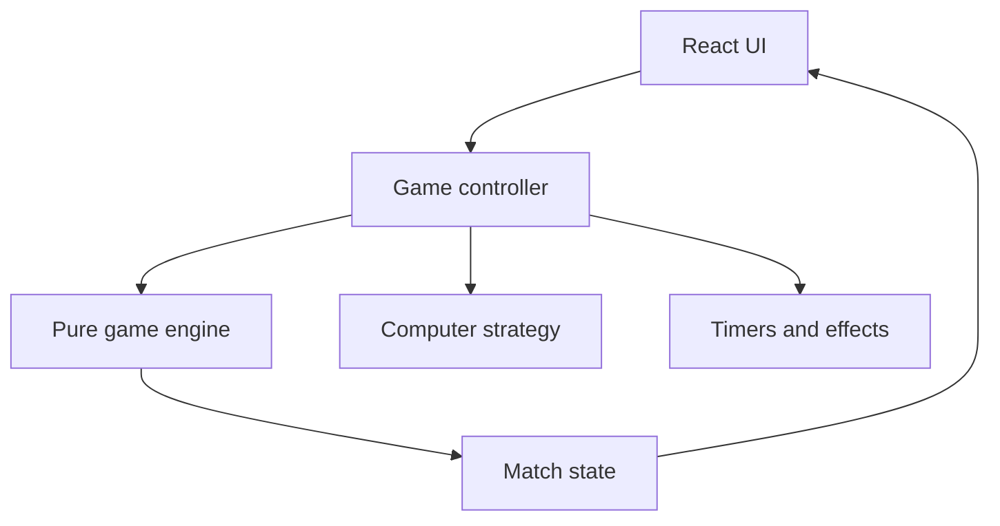

# Client-Only Architecture

## Design

The app is a single React/Vite frontend. Everything runs locally in one browser tab.



There is no backend boundary. Rules, bot strategy, effects, and presentation still remain separate so UI changes cannot alter scoring.

## Project structure

```text
hand-cricket/
├── public/assets/             # local assets only
├── src/
│   ├── components/
│   ├── screens/
│   ├── game/
│   │   ├── constants.js
│   │   ├── createGame.js
│   │   ├── reducer.js
│   │   ├── selectors.js
│   │   └── rules.js
│   ├── bot/
│   │   ├── chooseNumber.js
│   │   ├── chooseRole.js
│   │   ├── strategies.js
│   │   └── random.js
│   ├── hooks/useGameController.js
│   ├── storage/preferences.js
│   ├── styles/
│   ├── App.jsx
│   └── main.jsx
├── tests/{game,bot,components,e2e}/
├── index.html
├── package.json
└── vite.config.js
```

## Responsibilities

- Engine: pure immutable transitions; owns toss, score, outs, innings, target, result.
- Bot: receives allowed history and injected randomness; returns a number/role; never reads DOM or current human choice.
- Controller: commits choices, locks controls, schedules reveal, dispatches engine actions, cancels stale timers.
- UI: renders state and sends intentions; never calculates canonical score/winner.
- Storage: preferences only—difficulty, sound, reduced motion, optional name.

## Fair commitment sequence

1. Human clicks a number.
2. Controller snapshots history from before this click.
3. Bot generates and privately stores its choice without receiving the clicked value.
4. Number pad locks.
5. After 400–800 ms, both values are resolved and revealed together.

## Randomness

Use `crypto.getRandomValues` through an adapter during play. Inject a seeded function in tests. Never use random calls inside reducer or React components.

## Timer safety

- Centralize timeout IDs.
- Tag every pending effect with `matchId` and `roundId`.
- Cancel on New Match, incompatible phase change, or unmount.
- Verify tokens before a timeout dispatches.
- Use fake timers in tests.

## Offline operation

- Use bundled/system fonts and local assets.
- Keep a tested production build.
- Bind to localhost only unless other devices must connect.
- Avoid service workers unless intentionally tested; stale caches complicate demos.
